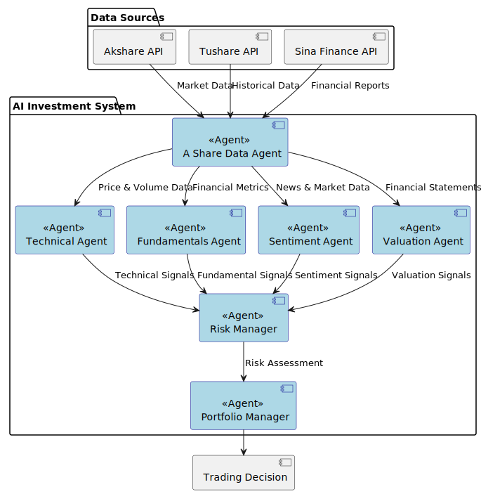

# AI 投资系统

这个系统目前是只支持 A 股的哈。

这是一个基于人工智能的投资系统概念验证项目。项目目标是探索如何使用 AI 来辅助投资决策。本项目仅用于**教育目的**，不适用于实际交易或投资。

系统由以下几个协同工作的 agent 组成：

1. A Share Data Agent - 负责收集和预处理市场数据
2. Valuation Agent - 计算股票内在价值并生成交易信号
3. Sentiment Agent - 分析市场情绪并生成交易信号
4. Fundamentals Agent - 分析基本面数据并生成交易信号
5. Technical Analyst - 分析技术指标并生成交易信号
6. Risk Manager - 计算风险指标并设置仓位限制
7. Portfolio Manager - 制定最终交易决策并生成订单



注意：系统仅模拟交易决策，不进行实际交易。

## 免责声明

本项目仅用于**教育和研究目的**。

- 不适用于实际交易或投资
- 不提供任何保证
- 过往业绩不代表未来表现
- 创建者不承担任何财务损失责任
- 投资决策请咨询专业理财顾问

使用本软件即表示您同意仅将其用于学习目的。

## Setup

1. Get your Gemini API key from https://aistudio.google.com/
2. Get your Tushare token from https://tushare.pro/
3. Set up your environment variables:

```bash
# Create .env file for your API keys
cp .env.example .env
```

你可以通过以下两种方式设置环境变量:

1. **直接修改 .env 文件**
   打开 .env 文件,填入你的 API key:

```
GEMINI_API_KEY=your-gemini-api-key-here
GEMINI_MODEL=gemini-1.5-flash
TUSHARE_TOKEN=your-tushare-token-here
```

2. **通过命令行设置**

Unix/macOS:

```bash
export GEMINI_API_KEY='your-gemini-api-key-here'
export GEMINI_MODEL='gemini-1.5-flash'
export TUSHARE_TOKEN='your-tushare-token-here'
```

Windows PowerShell:

```powershell
$env:GEMINI_API_KEY='your-gemini-api-key-here'
$env:GEMINI_MODEL='gemini-1.5-flash'
$env:TUSHARE_TOKEN='your-tushare-token-here'
```

注意: 推荐使用第一种方式(修改 .env 文件)。

## Usage

### Running the analysis

系统支持多种运行方式，可以根据需要组合使用不同的参数：

1. **基本运行**

```bash
python -m main --ticker 301155
```

这将使用默认参数运行系统，包括：

- 默认分析 5 条新闻（num_of_news=5）
- 不显示详细分析过程（show_reasoning=False）
- 使用默认的初始资金（initial_capital=100,000）

2. **显示分析推理过程**

```bash
python -m main --ticker 301155 --show-reasoning
```

这将显示每个智能体（Market Data Agent、Technical Analyst、Fundamentals Agent、Sentiment Agent、Risk Manager、Portfolio Manager）的分析过程和推理结果。

这允许你设置：

- initial_capital: 初始现金金额（可选，默认为 100,000）

4. **自定义新闻分析数量和具体日期的投资建议**

```bash
python -m main --ticker 301157 --show-reasoning --end-date 2024-12-11 --num-of-news 20
```

这将：

- 分析指定日期范围内最近的 20 条新闻进行情绪分析
- start-date 和 end-date 格式为 YYYY-MM-DD

5. **回测功能**

```bash
python -m backtester --ticker 301157 --start-date 2024-12-11 --end-date 2025-01-07 --num-of-news 20
```

回测功能支持以下参数：

- ticker: 股票代码
- start-date: 回测开始日期（YYYY-MM-DD）
- end-date: 回测结束日期（YYYY-MM-DD）
- initial-capital: 初始资金（可选，默认为 100,000）
- num-of-news: 情绪分析使用的新闻数量（可选，默认为 5，最大为 100）

### 参数说明

- `--ticker`: 股票代码（必需）
- `--show-reasoning`: 显示分析推理过程（可选，默认为 false）
- `--initial-capital`: 初始现金金额（可选，默认为 100,000）
- `--num-of-news`: 情绪分析使用的新闻数量（可选，默认为 5，最大为 100）
- `--start-date`: 开始日期，格式 YYYY-MM-DD（可选）
- `--end-date`: 结束日期，格式 YYYY-MM-DD（可选）

### 输出说明

系统会输出以下信息：

1. 基本面分析结果
2. 估值分析结果
3. 技术分析结果
4. 情绪分析结果
5. 风险管理评估
6. 最终交易决策

如果使用了`--show-reasoning`参数，还会显示每个智能体的详细分析过程。

**Example Output:**

```
正在获取 301157 的历史行情数据...
开始日期：2024-12-11
结束日期：2024-12-11
成功获取历史行情数据，共 242 条记录

警告：以下指标存在NaN值：
- momentum_1m: 20条
- momentum_3m: 60条
- momentum_6m: 120条
...（这些警告是正常的，是由于某些技术指标需要更长的历史数据才能计算）

正在获取 301157 的财务指标数据...
获取实时行情...
成功获取实时行情数据

获取新浪财务指标...
成功获取新浪财务指标数据，共 3 条记录
最新数据日期：2024-09-30 00:00:00

获取利润表数据...
成功获取利润表数据

构建指标数据...
成功构建指标数据

Final Result:
{
  "action": "buy",
  "quantity": 12500,
  "confidence": 0.42,
  "agent_signals": [
    {
      "agent": "Technical Analysis",
      "signal": "bullish",
      "confidence": 0.6
    },
    {
      "agent": "Fundamental Analysis",
      "signal": "neutral",
      "confidence": 0.5
    },
    {
      "agent": "Sentiment Analysis",
      "signal": "neutral",
      "confidence": 0.8
    },
    {
      "agent": "Valuation Analysis",
      "signal": "bearish",
      "confidence": 0.99
    },
    {
      "agent": "Risk Management",
      "signal": "buy",
      "confidence": 1.0
    }
  ],
  "reasoning": "Risk Management allows a buy action with a maximum quantity of 12500..."
}
```

### 日志文件说明

系统会在 `logs/` 目录下生成以下类型的日志文件：

1. **回测日志**

   - 文件名格式：`backtest_{股票代码}_{当前日期}_{回测开始日期}_{回测结束日期}.log`
   - 示例：`backtest_301157_20250107_20241201_20241230.log`
   - 包含：每个交易日的分析结果、交易决策和投资组合状态

2. **API 调用日志**
   - 文件名格式：`api_calls_{当前日期}.log`
   - 示例：`api_calls_20250107.log`
   - 包含：所有 API 调用的详细信息和响应

所有日期格式均为 YYYY-MM-DD。如果使用了 `--show-reasoning` 参数，详细的分析过程也会记录在日志文件中。

## 贡献指南

1. Fork 本仓库
2. 创建特性分支
3. 提交更改
4. 推送到分支
5. 创建 Pull Request

## 许可证

本项目基于 MIT 许可证 - 详见 LICENSE 文件。
